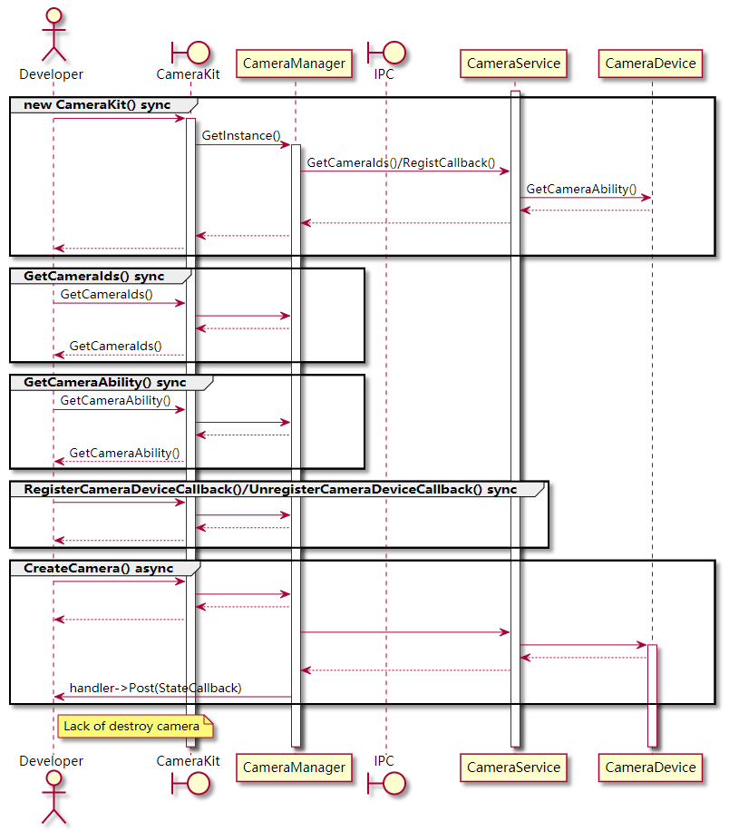

# Overview

## Basic Concepts

Camera is one of the services provided by the OpenHarmony media subsystem. The camera module provides recording, preview, and photographing features and supports concurrent stream reading by multiple users.

It is considered good practice that you understand the following concepts before starting development:

-   Video frame

    A video frame is formed by the stream data of a video image. Video data streams are formed by a series of image data arranged at a fixed time interval.

-   Frame per second \(FPS\)

    FPS is used to represent the frame rate at which images are refreshed during video playback, or the number of frames per second during video playback. A higher frame rate means smoother video playback.

-   Resolution

    Information about each image frame consists of pixels. The number of pixels in an image is presented by the resolution. For example, 1080p \(1920 x 1080\) indicates that the image width is 1920 pixels and the image height is 1080 pixels.

## Working Principles

-   Media services

    Media services are started by the  **Init**  process upon system startup, and media hardware resources \(such as memory, display hardware, image sensors, and codecs\) are initialized and allocated. During the initialization, the configuration file is parsed, which determines the upper limit of capabilities and resources of each service. Generally, the upper limit is configured by original equipment manufacturers \(OEMs\) in the configuration file. The following configuration items are available for the camera service during media service initialization:

    -   Memory pool: Memory blocks in the memory pool are accessed and released continuously by all media services.
    -   Image sensor: sensor type, resolution, ISP, and more
    -   Image processor: resolution, bit rate, image inversion, and more
    -   Image encoder: encoding format, bit rate, resolution, and more

-   Major classes

    You can use the  **Camera**  class and its asynchronous callback classes to configure and access the camera functionalities. The three callback classes correspond to different asynchronous processing scenarios, as described in  [Table 1](#table486418149411).

    **Table  1**  Class description

    
    <table><thead align="left"><tr id="row19864414104115"><th class="cellrowborder" valign="top" width="22.322232223222326%" id="mcps1.2.4.1.1">
Class

    </th>
    <th class="cellrowborder" valign="top" width="44.34443444344435%" id="mcps1.2.4.1.2">
Description

    </th>
    <th class="cellrowborder" valign="top" width="33.33333333333333%" id="mcps1.2.4.1.3">
Examples

    </th>
    </tr>
    </thead>
    <tbody><tr id="row138651914104113"><td class="cellrowborder" valign="top" width="22.322232223222326%" headers="mcps1.2.4.1.1 ">
Camera

    </td>
    <td class="cellrowborder" valign="top" width="44.34443444344435%" headers="mcps1.2.4.1.2 ">
Configures the static camera capability through the configuration class to use basic camera functionalities.

    </td>
    <td class="cellrowborder" valign="top" width="33.33333333333333%" headers="mcps1.2.4.1.3 ">
Photographing, video recording, and previewing

    </td>
    </tr>
    <tr id="row98656144413"><td class="cellrowborder" valign="top" width="22.322232223222326%" headers="mcps1.2.4.1.1 ">
CameraDeviceCallback

    </td>
    <td class="cellrowborder" valign="top" width="44.34443444344435%" headers="mcps1.2.4.1.2 ">
Handles camera hardware state changes.

    </td>
    <td class="cellrowborder" valign="top" width="33.33333333333333%" headers="mcps1.2.4.1.3 ">
Available or unavailable

    </td>
    </tr>
    <tr id="row167872310411"><td class="cellrowborder" valign="top" width="22.322232223222326%" headers="mcps1.2.4.1.1 ">
CameraStateCallback

    </td>
    <td class="cellrowborder" valign="top" width="44.34443444344435%" headers="mcps1.2.4.1.2 ">
Handles camera instance state changes.

    </td>
    <td class="cellrowborder" valign="top" width="33.33333333333333%" headers="mcps1.2.4.1.3 ">
Created or released

    </td>
    </tr>
    <tr id="row886581414118"><td class="cellrowborder" valign="top" width="22.322232223222326%" headers="mcps1.2.4.1.1 ">
FrameStateCallback

    </td>
    <td class="cellrowborder" valign="top" width="44.34443444344435%" headers="mcps1.2.4.1.2 ">
Handles frame status changes.

    </td>
    <td class="cellrowborder" valign="top" width="33.33333333333333%" headers="mcps1.2.4.1.3 ">
Start and end of photographing, and frame rate changes

    </td>
    </tr>
    </tbody>
    </table>

-   Stream transfer

    A surface is the basic data structure for transferring audio and video data. A camera is generally used as the data producer of a surface and has specific consumers in different scenarios.

    Camera preview and recording outputs are video streams, and photographing outputs are image frames. The outputs are transferred through the  **Surface**  class. A surface can transmit media information streams within and cross processes.

    Take video recording as an example. You create a  **Recorder**  instance, obtain the surface of the  **Recorder**  instance, and then transfer the surface to the  **Camera**  instance. In this case, the  **Camera**  instance works as a producer to inject video streams to the surface, and the  **Recorder**  instance act as the consumer to obtain video streams from the surface for storage. In this case, you connect the recorder and camera through the surface.

    Similarly, you can create a surface, implement consumer logic for it, and transfer it to the  **Camera**  instance. For example, transmit video streams over the network or save captured frame data as an image file.

    The graphics module also obtains stream resources from the camera module through surfaces. For details, see development guidelines on  [Graphic](graphics.md).

-   Camera running process
    1.  Creating a camera

        This process creates a  **Camera**  instance by  **CameraManager**, binds the camera device to the server, and asynchronously notifies you of the successful creation. The following figure shows the time sequence between classes.

        **Figure  1**  Sequence diagram for creating a camera  
        

        

    1.  Taking a video/Previewing

        This process creates a  **Camera**  instance via  **CameraKit**, and configures frame attributes via  **FrameConfig**  for recording or previewing. The following figure shows the time sequence.

        **Figure  2**  Sequence diagram for recording/previewing  
        

        

